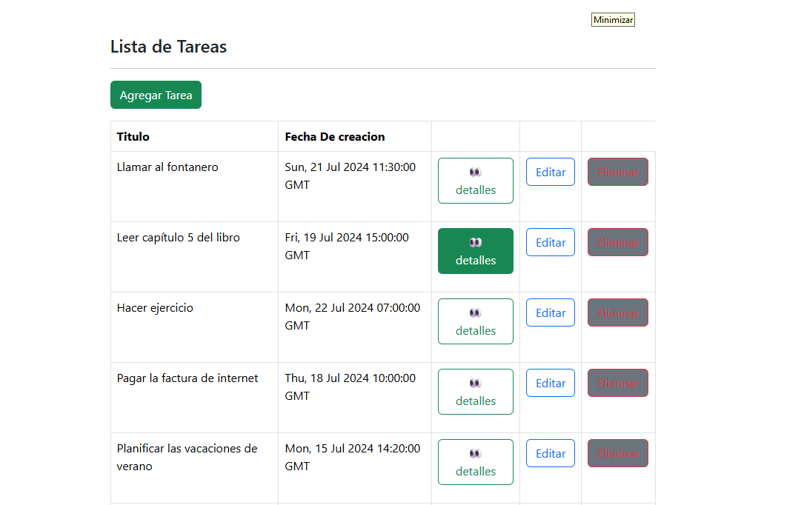
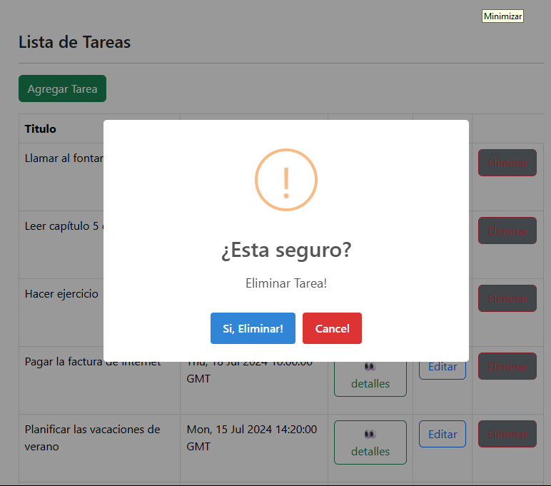

# ToDo App

Aplicación web para la gestión de tareas (ToDo) desarrollada con React, TypeScript, Vite y un backend en Node.js + Express.

---

## 📝 Funcionalidades

- Crear nuevas tareas con título y descripción.
- Listar todas las tareas existentes.
- Ver detalles de una tarea.
- Editar tareas existentes.
- Marcar tareas como completadas o incompletas.
- Eliminar tareas.
- Interfaz amigable y responsiva usando Reactstrap y Bootstrap.

---

## 🌠 Capturas de la App



---



---

## 🚀 Paso a paso para ejecutar el proyecto

### 1. Clonar el repositorio

```sh
git clone https://github.com/miguell29/todo-app.git
cd todo-app
```

### 2. Configurar variables de entorno

- copiar el contenido de  los archivos `.env.example` a `.env ` y `.env.local ` tanto en `backend/` como en `frontend/` respectivamente y ajustar los valores si es necesario.

### 3. Instalar dependencias

#### Backend

```sh
cd backend
npm install
```

#### Frontend

```sh
cd ../frontend
npm install
```

### 4. Ejecutar el backend

```sh
cd backend
npm run dev
```
El backend estará disponible por defecto en [http://localhost:3000/api/task](http://localhost:3000/api/task).

### 5. Ejecutar el frontend

En otra terminal:

```sh
cd frontend
npm run dev
```
La aplicación frontend estará disponible en [http://localhost:5173](http://localhost:5173).

---

## 📁 Estructura del proyecto

```plaintext
todo-app/
│
├── backend/
│   ├── controllers/
│   ├── data/
│   ├── models/
│   ├── routes/
│   ├── app.js
│   └── package.json
│
└── frontend/
    ├── src/
    │   ├── components/
    │   ├── hooks/
    │   ├── Interfaces/
    │   └── App.tsx
    ├── public/
    ├── index.html
    └── package.json
```

---

## 💡 Notas

- El backend utiliza un archivo en memoria para almacenar las tareas (no hay base de datos).
- Puedes modificar los endpoints o la estructura según tus necesidades.
- Para producción, se recomienda agregar autenticación y persistencia en base de datos.

---